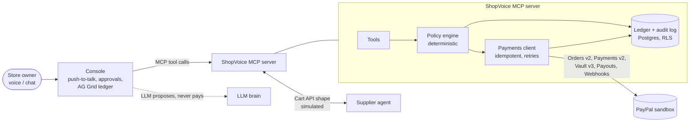

# ShopVoice Pay

**A voice-first purchasing agent for independent grocers. It reorders from suppliers and pays them through PayPal, but only within spending rules the owner sets, and it pays only for what actually arrived.**

> Status: **M0, under construction** for the [PayPal AI Hackathon](https://paypalaihackathon.devpost.com) (Oct–Nov 2026).
> The hosted demo, sandbox buyer login and video link will be added here before submission. Until then, the sections below that say "planned" describe planned work, not finished features.

## The 30-second pitch

Corner-store owners run on thin margins and late nights: stock-outs, supplier calls, paper invoices, and payments squeezed in after closing. An AI agent that "can pay" sounds like help, until it hallucinates an order or pays twice. That is real money.

ShopVoice Pay makes agentic payments trustworthy with three rules:

1. **The model cannot break the rules.** Spending policy (per-order limits, budgets, allow-listed suppliers, price-jump checks, duplicate detection) is enforced in deterministic server code. The LLM can only *propose* a payment.
2. **Money is held, not sent, until delivery is verified.** Orders use PayPal `intent: AUTHORIZE`. On delivery the agent compares PO, delivery count and invoice (a 3-way match), captures only what arrived, and voids the rest.
3. **A human approves exactly where the risk is.** Routine, in-policy orders auto-pay from the owner's vaulted PayPal account. Anything unusual (a new supplier, a 31% price jump, triple the usual quantity) steps up to a one-tap or spoken "yes".

Meet Maria (fictional), who runs a corner store in Queens. While closing up, she says "Reorder milk and eggs." The milk order ($84, allow-listed supplier) is authorized automatically: *held, not charged*. Eggs went up 31%, so the agent asks first. The next morning 10 of 12 crates arrive. Maria snaps the invoice, and the agent charges for 10 and releases the rest. Every authorization, capture, void and refund appears in a ledger, with the reason the agent took that action.

## Try it

**Hosted demo:** planned (Render). It will include the sandbox buyer login and a "Reset demo" button.

**Locally, today (about 2 minutes, no accounts needed):**

```bash
git clone https://github.com/vansyson1308/shopvoice-pay && cd shopvoice-pay
npm ci
npm test            # build + unit tests, with PayPal mocked
npm run demo:e2e    # voice flow against the in-memory demo store
```

`PAYPAL_MODE=mock` (the default) runs an in-process fake of the PayPal endpoints we use, so nothing leaves your machine. Its behaviour was calibrated against the real sandbox ([SPIKE.md](docs/paypal/SPIKE.md)). To run against the real PayPal sandbox, copy `.env.example` to `.env`, set `PAYPAL_MODE=sandbox` with sandbox REST app credentials, and run `npm run spike` and `npm run test:sandbox`.

## Architecture



Details: [docs/paypal/ARCHITECTURE.md](docs/paypal/ARCHITECTURE.md). Day-1 sandbox spike: [docs/paypal/SPIKE.md](docs/paypal/SPIKE.md). Decisions: [docs/paypal/DECISIONS.md](docs/paypal/DECISIONS.md).

## PayPal APIs used

| API | Endpoint | Used for |
|---|---|---|
| OAuth 2.0 | `POST /v1/oauth2/token` | client-credentials access token |
| Orders v2 | `POST /v2/checkout/orders` (`intent: AUTHORIZE`), `GET …/{id}`, `POST …/{id}/authorize` | supplier orders: vaulted (auto-pay) or buyer-approved (step-up) |
| Payments v2 | `POST /v2/payments/authorizations/{id}/capture`, `…/void`, `…/reauthorize`, `GET …` | pay on delivery: full or partial capture, release the remainder, extend past the 3-day honor period |
| Payments v2 | `POST /v2/payments/captures/{id}/refund`, `GET /v2/payments/refunds/{id}` | refunds for spoiled or short goods |
| Vault v3 | `POST /v3/vault/setup-tokens`, `POST /v3/vault/payment-tokens`, `GET`/`DELETE …/{id}` | "Connect PayPal" once, then merchant-initiated payments with no checkout |
| Payouts v1 | `POST /v1/payments/payouts`, `GET …/{batch_id}` | supplier settlement: orders are paid to the ShopVoice platform account, and suppliers are paid out for what was captured (DECISIONS.md D1, confirmed in sandbox) |
| Webhooks v1 | `POST /v1/notifications/webhooks`, `POST /v1/notifications/verify-webhook-signature` | ledger sync; polling fallback for local runs |
| Agent Toolkit | `@paypal/agent-toolkit` 1.11.0: `create_invoice`, `send_invoice`, `create_shipment_tracking`, `get_shipment_tracking`, `list_transactions`, `get_order`, `create_refund` | planned: invoices for the store's catering orders, shipment tracking, and the transaction list for spend summaries, wrapped behind the policy layer |
| Agentic Commerce Cart API v1 | merchant side: `POST /merchant-cart`, `PUT /merchant-cart/{id}`, `POST /merchant-cart/{id}/checkout` | planned: a **simulated** supplier agent that ShopVoice negotiates with |

Every POST carries a `PayPal-Request-Id` idempotency key. Retries only ever replay the same key.

**Demo settlement vs. production.** The demo charges the shop into a ShopVoice platform sandbox account and pays suppliers out with Payouts. We chose that because the sandbox spike showed the direct routes are closed to a self-serve app:
- a vaulted payment to a supplier payee is rejected (`BILLING_AGREEMENT_NOT_FOUND`);
- the platform cannot release a hold it is not the payee of (403 `PERMISSION_DENIED`).

In production, ShopVoice would use PayPal's multiparty partner onboarding, so suppliers are onboarded payees and ShopVoice never holds third-party funds. See [DECISIONS.md → Production path](docs/paypal/DECISIONS.md#production-path-d1).

## AI used, and what is simulated

- **LLM brain** (planned for M2): tool calling through Amazon Bedrock, OpenAI or Anthropic, chosen by the `BRAIN` env var. An offline `rules` brain runs the tests. The LLM handles understanding requests, summarising spend, reading supplier invoices (vision), negotiating substitutions within policy, and explaining decisions. **It never decides whether money moves.**
- **Simulated:** the supplier's seller agent implements PayPal's Cart API merchant spec. In production, PayPal Store Sync would connect real suppliers. Anything simulated is labelled as such in the UI.
- All store, supplier and product data is fictional. Products have generic names ("Whole milk, 1 gal").

## Repository layout

```
apps/mcp-server   MCP server, OAuth 2.1, REST for the console, payments client (src/payments)
apps/console      push-to-talk voice + chat console (MCP client)
packages/common   logging, Postgres/RLS helpers, rate limiting, crypto
db/migrations     Postgres schema with forced row-level security
scripts/paypal    sandbox spike runners
tests/            unit (PayPal mocked), db (Postgres), sandbox (real sandbox, opt-in)
docs/paypal       spike, architecture, decisions, build log
```

## Credits and license

ShopVoice Pay is built on parts of [GroceryClaw](https://github.com/vansyson1308/groceryclaw) (MIT), imported at commit `0fb3af4`. GroceryClaw's production ingestion pipeline (Telegram/Zalo gateway, worker, KiotViet POS sync) stays in that repository and is not part of this demo. See [NOTICE](NOTICE) and [BUILT_DURING_PAYPAL.md](BUILT_DURING_PAYPAL.md).

MIT License, see [LICENSE](LICENSE). PayPal is a trademark of PayPal, Inc. This project is not affiliated with PayPal.
