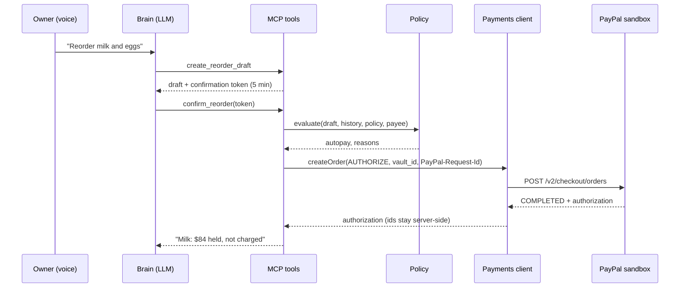

# Architecture

Status: **M0 draft.** The payments client exists and is tested. Policy, ledger, delivery matching, the LLM brain and the console redesign are planned for M1 and M2, and are described here as the target design.

## Components

| Component | Path | Role |
|---|---|---|
| MCP server | `apps/mcp-server` | MCP tools (Streamable HTTP), OAuth 2.1 for Claude/other MCP clients, REST for the console, `/paypal/webhook` |
| Payments client | `apps/mcp-server/src/payments` | Thin PayPal REST client: OAuth, idempotency keys, safe retries, mock mode **(done)** |
| Policy engine | `apps/mcp-server/src/policy` | Pure function `(draft, history, policy, payee) → {decision, reasons[], limits_remaining}`. The only gate on money movement. (M1) |
| Ledger | `apps/mcp-server/src/ledger` | `supplier_payments` state machine, memory and Postgres repositories, plus audit log writes (M1) |
| Reconcile | `apps/mcp-server/src/reconcile` | Invoice extraction (vision LLM, untrusted input) and a pure 3-way match (M2/M4) |
| Console | `apps/console` | Talk, Approvals, Ledger (AG Grid), Policy (AG Grid), Suppliers tabs. The LLM brain runs here as an MCP client (M2) |
| Supplier agent | `apps/supplier-agent` | **Simulated** seller agent implementing the Cart API merchant endpoints (M4) |

## Trust boundary

```
 LLM (untrusted planner) ──proposes──▶ MCP tools ──▶ policy engine (deterministic) ──▶ payments client ──▶ PayPal
                                         ▲                  │
         sees only: amounts, supplier    │                  └── writes ledger + audit log for every money action
         names, decision reasons, status │
         never: vault ids, PayPal ids, approval tokens, secrets
```

- The LLM can call `create_reorder_draft`, then `confirm_reorder` with the confirmation token. It cannot pick a payment method, a payee or an amount that differs from the stored draft. The server derives all three.
- Step-up approval tokens are sent to the console UI (approval card) and never appear in tool output that reaches the model. A spoken "yes" is matched server-side against the pending approval for that session.
- Supplier invoice text (OCR) is data. It never enters the system prompt and cannot trigger tools.

## Money state machine (`supplier_payments.status`)

```
pending_approval ──approve──▶ authorized ──capture all──────────▶ captured ──refund──▶ refunded (partial: amount_refunded < captured)
      │                          │ ├─capture part + void rest──▶ partially_captured ──refund──▶ …
      │ decline/expire           │ └─void──────────────────────▶ voided
      ▼                          ▼
   voided                      failed (PayPal declined / expired)
```

Invariants (property-tested in M1): `captured + voided ≤ authorized`, `refunded ≤ captured`, and every transition has exactly one ledger event and one audit entry tied to one `PayPal-Request-Id`.

## Flows

### Auto-pay (in policy)



### Step-up

The policy returns `step_up` with reasons (for example "Eggs went up 31% against the 30-day average"). The server creates a `pending_approval` payment and an approval card. The owner approves by spoken "yes" (matched server-side) or a console tap; the vaulted authorization then proceeds as above. If no PayPal account is connected yet, the card shows the PayPal `payer-action` URL as a QR code for the phone.

### Delivery and 3-way match

`record_delivery` takes voice counts or an invoice photo. The pure matcher compares PO, received and invoiced lines, then:
- full delivery: `capture(final_capture: true)`
- short delivery within tolerance: `capture(delivered value, final_capture: false)` then `void`
- variance above tolerance: hold and step-up

### Settlement (D1)

Captured amounts, net of refunds, are paid to supplier sandbox accounts with Payouts in a settlement run. With `direct_payee` settlement there is no payout step.

## Data (migration 019, planned)

All tables are tenant-scoped with forced RLS, following the 017 pattern.

- `supplier_payees`: supplier_id, paypal_email / merchant_id, currency, verified
- `spend_policies`: per_order_autopay_max_minor, daily_max_minor, weekly_max_minor, hard_cap_minor, allow-listed supplier ids, price_jump_pct (20), substitution_tolerance_pct (5), require_delivery_check
- `payment_methods`: vault id envelope-encrypted (`packages/common` envelope crypto), payer label, status
- `supplier_payments`: the ledger (see the state machine above), decision + decision_reasons jsonb, created_by
- `payment_events`: append-only, one row per PayPal call (`request_id`, kind, amount, status, debug id)
- `deliveries`, `invoice_matches`: extracted lines, received quantities, result, variance

Money is `bigint` minor units plus a `char(3)` currency. The legacy `*_vnd` columns stay for the imported read tools until the US seed replaces them (M2).
