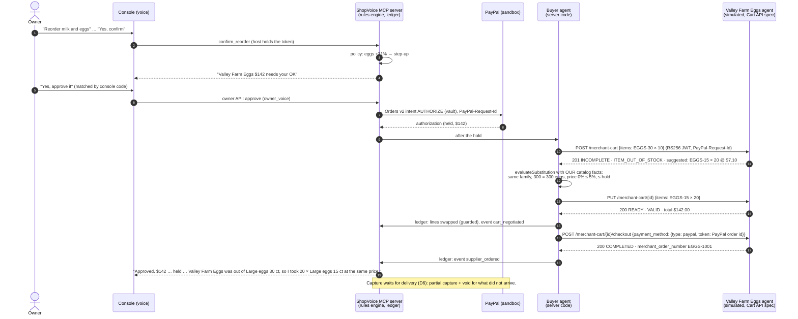

# Supplier agent (agent to agent, PayPal Cart API spec)

> **Simulated supplier agent implementing PayPal's Cart API spec. In production PayPal Store Sync connects real suppliers.**

ShopVoice's **buyer agent** places each held order with the **supplier's agent**. The supplier side implements the merchant endpoints of PayPal's Cart API v1 (`developer.paypal.com/api/agentic-commerce/v1`; see SPIKE.md §4.7).

In this demo the four suppliers are fictional, and their agents are simulated in `apps/supplier-agent`. By default they run inside the MCP server and are served at `/supplier-agent/<supplier code>/merchant-cart`. `SUPPLIER_AGENT_URL` points at a standalone deployment instead.

## Sequence: the hero egg order



## Rules the buyer agent follows (server code, never the model)

1. **When it runs.** After every PayPal hold (autopay, or an owner approval), and again on `sync` if the supplier agent was unreachable. It is idempotent: create and checkout carry a `PayPal-Request-Id`, and once a `supplier_ordered` event exists, nothing more happens.
2. **Out of stock with an alternative.** The alternative is accepted only if all of these hold:
   - its SKU is in **our** catalog;
   - our names for both products give the same family and the same base units (`productFacts`, e.g. "Large eggs 30 ct" → *large eggs*, 30);
   - the price change is within `substitution_tolerance_pct` (default 5%; `evaluateSubstitution`);
   - the new total is within the money already on hold.

   The ledger then swaps the order lines. `record()` guards the swap: only while held, before any charge, and never above the hold.
3. **Price change.** A lower price is accepted. A higher one is not, because the hold was approved at the old price.
4. **Anything else, or any rule fails.** The order stays as placed, still only held. The owner hears one short sentence, and the ledger records `cart_negotiated` with the reason.
5. **Supplier text is untrusted.** Names, `message` and `user_message` from the supplier are never spoken, never put in model context, and never written as ledger reasons. Speech and reasons are built from our own catalog and numbers. This is tested with a hostile agent that offers foreign SKUs, inflated quantities, malformed prices and an injected message.
6. **Authentication.** The buyer agent signs a short-lived RS256 JWT (`aud: shopvoice-supplier-agent`, `merchant_id`, `scope: ["cart"]`), the way PayPal authenticates to merchants. The supplier agent verifies it against our JWKS, published at `/.well-known/buyer-agent-jwks.json`.

## Merchant endpoints implemented (simulated)

| Endpoint | Behaviour |
|---|---|
| `POST /merchant-cart` | 201 with the cart. Business problems are reported in `validation_issues` (status `INCOMPLETE`, `validation_status` `INVALID`). 400 for malformed items; 422 only when no cart can be created. `PayPal-Request-Id` makes it idempotent. |
| `GET /merchant-cart/{id}` | 200, or 404 for an unknown cart or one belonging to another merchant. |
| `PUT /merchant-cart/{id}` | Full replacement; revalidated. 422 once the cart is `COMPLETED`. |
| `POST /merchant-cart/{id}/checkout` | Needs `READY` (otherwise 422 with the issues). Returns `payment_confirmation {merchant_order_number, order_review_page}`. Idempotent for the same PayPal order; refused for a different one. |

Issues produced:
- `INVENTORY_ISSUE` / `ITEM_OUT_OF_STOCK`, with `available_quantity` and `suggested_alternatives`;
- `INVENTORY_ISSUE` / `ITEM_NOT_AVAILABLE`;
- `PRICING_ERROR` / `PRICE_MISMATCH`, with `expected_price` and `current_price`.

`resolution_options` are `SUGGEST_ALTERNATIVE`, `ACCEPT_NEW_PRICE` and `REMOVE_ITEM`.

**Deviation from PayPal's flow (D6).** In PayPal's flow, the merchant captures at checkout. ShopVoice's suppliers only record the PayPal order id; ShopVoice captures on delivery, for what arrived.

## Tests

- `tests/unit/supplier-agent.test.mjs`: the merchant side.
  - JWT checks: missing, wrong merchant, wrong scope, wrong audience, expired, forged, unsigned.
  - Out of stock with an alternative; replacement to `READY`.
  - Checkout rules and idempotence; 400/404/422; request-id idempotence; price mismatch.
  - Product facts; the HTTP mount and JWKS.
- `tests/unit/supplier-orders.test.mjs`: the buyer side, through the console.
  - The hero substitution: $142 unchanged, then the delivery recorded against the new lines.
  - A substitute outside the rules; a hostile supplier agent.
  - An unreachable agent, retried on sync and never ordered twice.
  - The `negotiate_cart` tool.

## Running the agents standalone

```bash
npm run build
BUYER_AGENT_JWKS='[...]' node apps/supplier-agent/dist/server.js   # port 8092
# MCP server: SUPPLIER_AGENT_URL=http://localhost:8092 BUYER_AGENT_PRIVATE_KEY_PEM="$(cat buyer.pem)"
```
